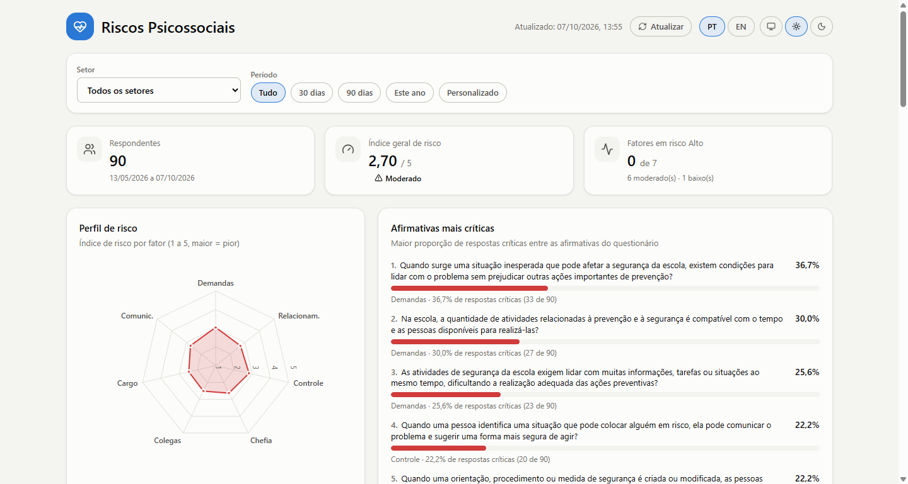
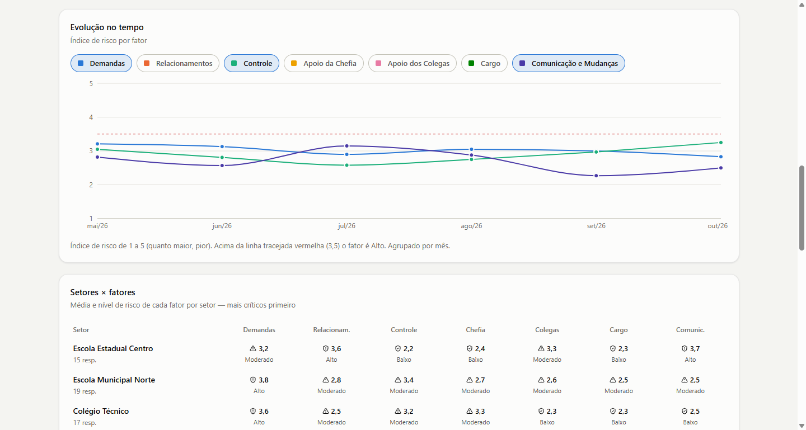
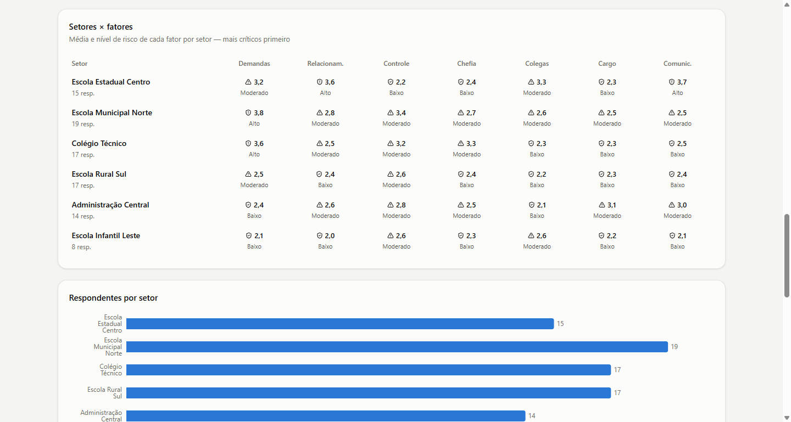
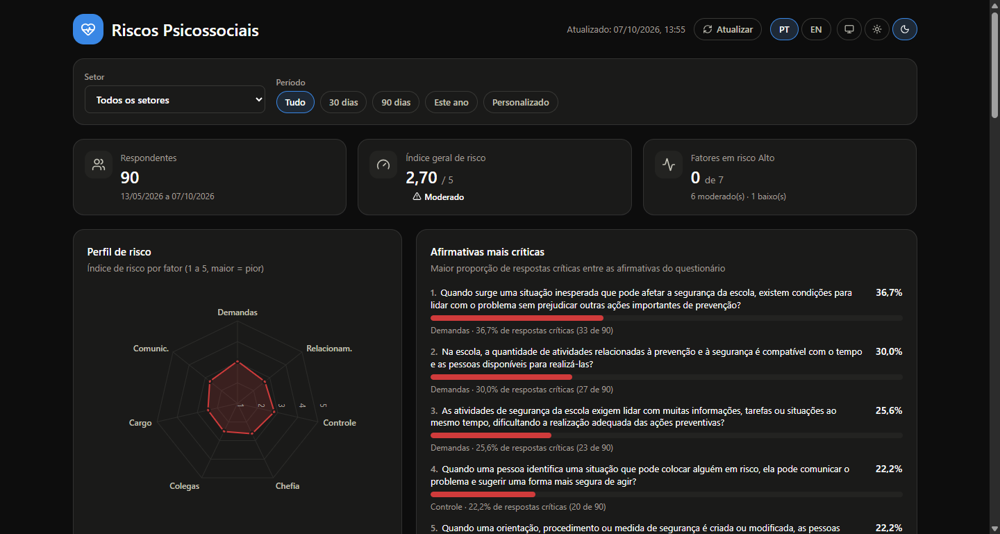
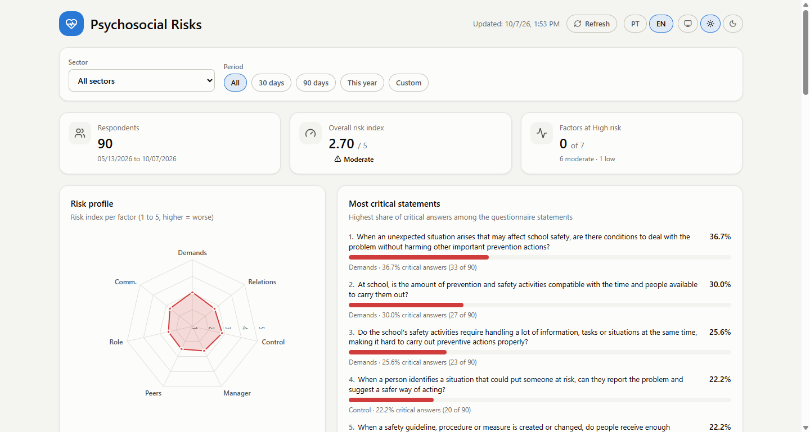

# IFPSE

### Painel de riscos psicossociais para a segurança escolar

O IFPSE transforma as respostas de um questionário curto em uma leitura clara de **como a
organização da escola pode ajudar ou dificultar a prevenção de acidentes**: carga de atividades,
relações entre as pessoas, participação, apoio da gestão, cooperação, clareza de papéis e
comunicação das mudanças.

Em vez de planilhas e relatórios longos, a CIPA, a coordenação e a gestão enxergam em uma única
tela **onde está o risco, quanto ele pesa e o que fazer a respeito**.

**[Acessar o painel](https://ifpse.vercel.app)**

Imagens com dados fictícios de demonstração.

---

## Por que o IFPSE

| Em vez de... | O IFPSE entrega |
| --- | --- |
| Respostas soltas, difíceis de comparar | Um **índice de risco por fator**, de 1 a 5, com nível Alto, Moderado ou Baixo |
| Descobrir o problema só depois do incidente | **Afirmativas mais críticas** em destaque, para saber por onde começar |
| Médias que escondem diferenças | **Mapa de calor por setor**, mostrando onde cada fator pesa mais |
| Um retrato de um único momento | **Evolução no tempo**, para ver se as ações estão funcionando |
| Resultado sem encaminhamento | **Plano de ação** com medidas sugeridas para cada fator em atenção |

## O que você vê

### Visão geral em segundos

Três indicadores no topo (respondentes, índice geral de risco e quantos dos sete fatores estão em
risco Alto), o **perfil de risco** em radar e a lista das afirmativas com mais respostas críticas.
Abaixo, um cartão para cada fator, com índice, nível e a proporção de respostas críticas.

### Evolução e comparação entre setores

Acompanhe como cada fator se move ao longo dos meses e veja, linha a linha, quais setores
concentram mais atenção.

### Do diagnóstico à ação

Para cada fator em risco Moderado ou Alto, o painel apresenta o **plano de ação** com as medidas
recomendadas, como revisão de processos, capacitação de lideranças, mediação de conflitos e gestão
participativa. Fatores em risco Alto pedem um plano específico.

## Os sete fatores

| Fator | O que observa |
| --- | --- |
| **Demandas** | Volume de atividades, prazos, ritmo e pausas |
| **Relacionamentos** | Conflitos, respeito e qualidade das relações |
| **Controle** | Participação nas decisões e autonomia |
| **Apoio da Chefia** | Suporte, orientação e encaminhamento pela gestão |
| **Apoio dos Colegas** | Cooperação e apoio mútuo entre as pessoas |
| **Cargo** | Clareza de responsabilidades e do que fazer diante de um risco |
| **Comunicação e Mudanças** | Como novas orientações e procedimentos chegam às pessoas |

## Como o risco é lido

1. Cada resposta vai de **Nunca (1)** a **Sempre (5)**. Quem não tem elementos para avaliar pode
   marcar N/A, e essa resposta **não entra no cálculo**.
2. O IFPSE considera o **sentido de cada afirmativa**: onde "sempre" é bom, a escala é invertida,
   de modo que uma nota maior sempre significa mais risco.
3. A média das notas de um fator é o **índice de risco**: **Alto** a partir de 3,5, **Moderado** a
   partir de 2,5 e **Baixo** abaixo disso.
4. Respostas com nota de risco 4 ou 5 são consideradas **críticas**, e a proporção delas aparece em
   cada fator.

## Uma ferramenta de triagem, com cuidado

O IFPSE **aponta onde olhar; não rotula pessoas nem faz diagnóstico**. Ele não avalia saúde mental
individual e não substitui avaliação psicológica, clínica ou social. Uma resposta crítica isolada
não define risco alto: a CIPA valida se a situação é recorrente, se aparece em outras pessoas e se
tem relação com a segurança escolar. O foco é sempre a **condição a ser melhorada** (comunicação,
papéis, demandas, apoio), nunca a pessoa ou o grupo.

- **Dados agregados e anônimos:** o painel mostra apenas resultados reunidos, e o nome de quem
  respondeu não é armazenado.
- **Risco nunca é só cor:** todo nível aparece com ícone e rótulo, para leitura clara também por
  quem tem daltonismo.

## Feito para o dia a dia

- **Atualização automática:** novas respostas aparecem no painel sem precisar recarregar.
- **Filtros** por setor e por período (30 dias, 90 dias, este ano ou datas personalizadas).
- **Em português e em inglês**, com troca em um clique.
- **Tema claro, escuro ou automático**, que acompanha o dispositivo.
- **Responsivo:** funciona no computador, no tablet e no celular.

## Base metodológica

O IFPSE se baseia no **Management Standards Indicator Tool**, referência internacional para
avaliar os fatores de organização do trabalho que mais afetam o bem-estar, adaptado pela CGC ao
contexto da **CIPA Escolar** e da segurança escolar. O questionário aplicado tem 15 afirmativas
distribuídas nos sete fatores. Os resultados conversam com as inspeções, o mapa de riscos e as
ações já desenvolvidas pela escola.

---

Informações técnicas para quem mantém o sistema: [CLAUDE.md](CLAUDE.md).
